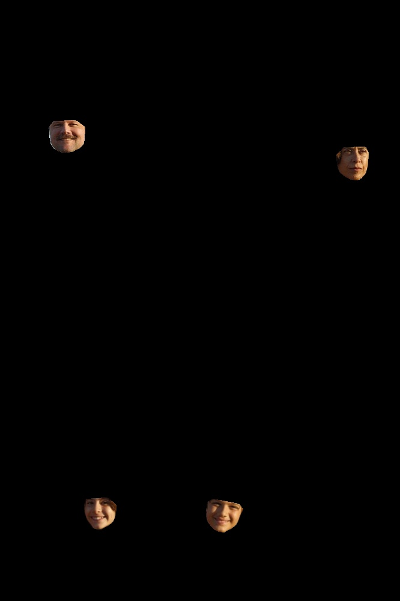

# Dlib Image Landmarks

This is a proof of concept for a project that uses the Dlib library to detect and extract facial landmarks in images.

```bash
# install dependencies
pip install -r requirements.txt

# usage
  python main.py <image-path>
```

Example:

```bash
  python main.py ./ainda-estou-aqui.jpg
```

## Sample

Input image:


Output image with detected faces:


